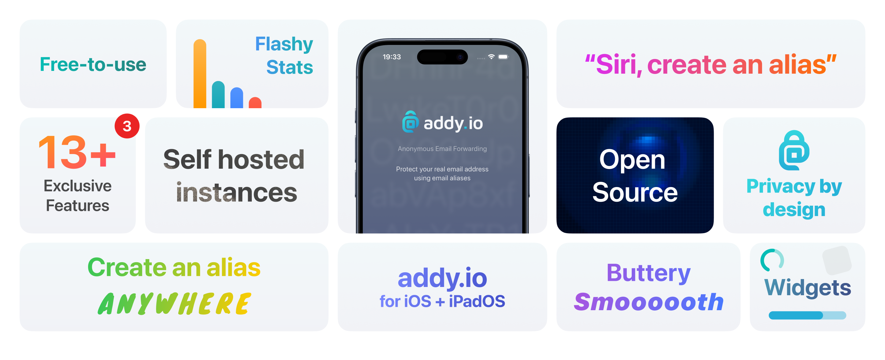

<h1 align="center">addy.io</h1>

Easily create and manage your addy.io aliases, recipients and more from your phone, tablet or wearable with this <b>gorgeous</b> addy.io app for iOS and iPadOS.
 

</a>

## Requirements

> addy.io

- addy.io instance running v1.2.3 or higher (current version of the addy.io app has been tested with v1.2.3)

> iOS and iPadOS

- iOS 17 or newer

## Characteristics

> Exciting ✨

- Connect to the hosted [addy.io](https://addy.io/) instance or your own self-hosted instance
- A unique, gorgeous and sleek design, based on the [Human Interface Guidelines](https://developer.apple.com/design/human-interface-guidelines)
- Support for Deep Link to easily deactivate aliases from the email banner
- Lock the app using Biometrics
- App exclusive features
  - Watching aliases for new emails
  - Send emails from aliases from anywhere by selecting and sharing text or an email address
  - Get notified on failed deliveries
  - Get notified on expiring subscriptions
  - Create aliases using Shortcuts and Siri
- Enable error logging to *locally* store exceptions for easy troubleshooting
- Widgets!

> Seriously 👓

**Security**

- Encrypted preferences, your API key and other addy.io related settings are securely stored on your device using
  the [Keychain API](https://developer.apple.com/documentation/security/keychain_services/)
- No stats, buried points or Device IDs, or even crash reporting (Except for Google Play Store builds). So if you get a crash, please share the crash
  info with me >_<.
- I am forgoing the convenient third-party collection SDK and various stats just so you can use it with confidence.  **What's yours is yours**.

 > Manage (add, edit, delete)

- Aliases
- Recipients
- Domains
- Usernames
- Rules
- Failed deliveries

## Download

Developer-led download channels:

> Recommended (access to beta's, automatic updates and support me :) )

- [App Store](https://apps.apple.com/app/addy-io/id6563138633)

> Other sources

- Coming soon?

## UI

- Designed by both me and my lovely UI guru @JustPlayingHard (💙)

## Open Source License.

Third party libraries used:

- [LoadingButton](https://github.com/changemin/LoadingButton) (locally, modified it to fit my needs)
- [CodeScanner](https://github.com/twostraws/CodeScanner)
- [keychain-swift](https://github.com/evgenyneu/keychain-swift) (locally, modified it to fit my needs)
- [SwiftUICharts](https://github.com/AppPear/ChartView) (locally, modified it to fit my needs)
- [Lottie](https://github.com/airbnb/lottie-ios)
- [WrappingHStack](https://github.com/ksemianov/WrappingHStack)
- [FeedKit](https://github.com/nmdias/FeedKit.git)
- [SwiftUI-Shimmer](https://github.com/markiv/SwiftUI-Shimmer)
- [ThirdPartyMailer](https://github.com/vtourraine/ThirdPartyMailer) (locally, modified it to fit my needs)
- [Shiny](https://github.com/maustinstar/shiny)
- [SwiftHTMLToMarkdown](https://github.com/ActuallyTaylor/SwiftHTMLToMarkdown)

## Feedback and contribution

I welcome your comments and suggestions in the issues section, or you can contribute your code by submitting a PR directly to me. Of course, you can
also directly contact me via telegram or email and I'll get back to you.

## Donation

## Privacy policy
[Privacy policy](https://github.com/anonaddy/addy-ios/blob/master/PrivacyPolicy.md)
